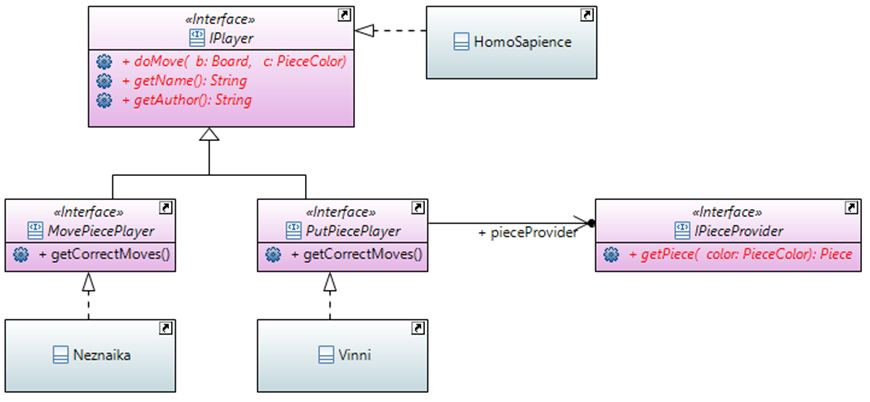
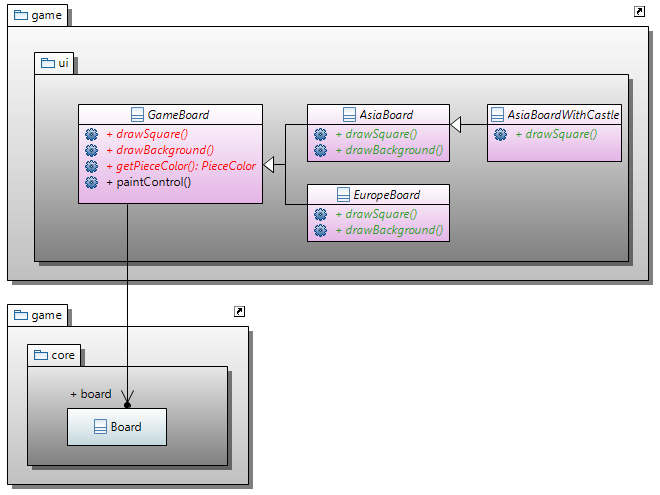

# Блокнот игр на языке Котлин

## 1. Архитектура программы
 


Пакет ***game*** базовый пакет для всех разрабатываемых игр. 

## 2. Ядро игр


### Цвет

```kotlin
enum class PieceColor {
    BLACK, WHITE, GREEN, BLUE
}
```

### Направления

Для линейных фигур класс-перечисление ***Dirs***:

```kotlin
enum class Dirs(
        /**
         * Смещение по вертикали.
         */
        @JvmField
        val dv: Int,
        /**
         * Смещение по горизонтали.
         */
        @JvmField
        val dh: Int,
) {
    LEFT_UP(-1, -1),   UP(+0, -1),   RIGHT_UP(+1, -1),
    LEFT(-1, +0),                    RIGHT(+1, +0),
    LEFT_DOWN(-1, +1), DOWN(+0, +1), RIGHT_DOWN(+1, +1);

    companion object {
        @JvmField
        val ALL = arrayOf(LEFT_UP, UP, RIGHT_UP, LEFT, RIGHT, LEFT_DOWN, DOWN, RIGHT_DOWN)

        @JvmField
        val DIAGONAL = arrayOf(LEFT_UP, RIGHT_UP, LEFT_DOWN, RIGHT_DOWN)
        val LINES = arrayOf(UP, LEFT, RIGHT, DOWN)
        val VERTICAL = arrayOf(UP, DOWN)
        val HORIZONTAL = arrayOf(LEFT, RIGHT)

        @JvmField
        val PAIRS = arrayOf(arrayOf(LEFT, RIGHT), arrayOf(UP, DOWN), arrayOf(LEFT_UP, RIGHT_DOWN), arrayOf(LEFT_DOWN, RIGHT_UP))
    }
}
```

Для коня класс-перечисление ***KnightDirs***:

```kotlin
enum class KnightDirs(
        /**
         * Смещение по вертикали.
         */
        private val dv: Int,
        /**
         * Смещение по горизонтали.
         */
        private val dh: Int,
) {
    LEFT_UP1(-1, +2),
    RIGHT_UP1(+2, +1),
    LEFT_UP2(-2, +1),
    RIGHT_UP2(+1, +2),
    LEFT_UP3(-2, -1),
    RIGHT_UP3(-1, +2),
    LEFT_UP4(-1, -2),
    RIGHT_UP4(-2, +1);

    companion object {
        val ALL = arrayOf(LEFT_UP1, RIGHT_UP1, LEFT_UP2, RIGHT_UP2, LEFT_UP3, RIGHT_UP3, LEFT_UP4, RIGHT_UP4)
    }
}
```

### Клетка

```kotlin
class Square(
        /**
         * Доска на которой расположена клетка.
         */
        val board: Board,
        /**
         * Вертикаль клетки.
         */
        @kotlin.jvm.JvmField
        val v: Int,
        /**
         * Горизонталь клетки.
         */
        @kotlin.jvm.JvmField
        val h: Int,
) {
    /**
     * Фигура которая, возможно, стоит на клетке.
     */
    @kotlin.jvm.JvmField
    var piece: Piece? = null
   
    // ...
}

```

### Фигура

```kotlin
abstract class Piece(@JvmField var square: Square, var color: PieceColor) {
    abstract fun isCorrectMove(vararg squares: Square): Boolean

    abstract fun makeMove(vararg squares: Square): Move
}
```

### Доска

```kotlin
class Board(
        /**
         * Количество вертикалей на доске.
         */
        @JvmField var nV: Int = 0,
        /**
         * Количество горизонталей на доске.
         */
        @JvmField var nH: Int = 0,
)
    : Observable() {
    /**
     * История партии (последовательность ходов игры).
     */
    @JvmField
    val history: History = History(this)

    operator fun contains(square: Square) =
            (square.v in 0..nV-1) && (square.h in 0 until nH)

    operator fun get(v: Int, h: Int) = squares[v][h]

    private val players: MutableMap<PieceColor, IPlayer> = mutableMapOf(
            PieceColor.WHITE to IPlayer.HOMO_SAPIENCE,
            PieceColor.BLACK to IPlayer.HOMO_SAPIENCE)
 
    var whitePlayer: IPlayer
        get() = players[PieceColor.WHITE]!!
        set(value) {
            players[PieceColor.WHITE] = value
            setBoardChanged()
        }

    var blackPlayer: IPlayer
        get() = players[PieceColor.BLACK]!!
        set(value) {
            players[PieceColor.BLACK] = value
            setBoardChanged()
        }

}
```

### Игрок

```kotlin
interface IPlayer {
    val name: String

    val authorName: String

    @Throws(GameOver::class)
    fun doMove(board: Board, color: PieceColor)

    companion object {
        @JvmField
        val HOMO_SAPIENCE: IPlayer = object : IPlayer {
            override val name: String
                get() = "Homo sapience"
            override val authorName: String
                get() = "Это я"

            override fun doMove(board: Board, color: PieceColor) {}
            override fun toString(): String = name
        }
    }
}
```

### История

```kotlin
class History (val board: Board) {
    var curMoveNumber = -1

    val moves: MutableList<Move> = mutableListOf()

    var result = GameResult.UNKNOWN
    
    fun toNextMove() {
        if (curMoveNumber < moves.size - 1) try {
            moves[++curMoveNumber].doMove()
        } catch (e: GameOver) {
            result = e.result
        }
    }

    fun toPrevMove() {
        if (curMoveNumber >= 0) moves[curMoveNumber--].undoMove()
    }

}
```

### Ход

```kotlin
interface Move {
    /**
     * @return фигура которая делает ход
     */
    val piece: Piece?

    /**
     * Сделать ход (расстановку или перемещение фигур на доске).
     *
     * @throws GameOver при попытке сделать ход может быть обнаружена
     * позиция когда игра должна быть завершена (пат) или противник сдается.
     */
    @Throws(GameOver::class)
    fun doMove()

    /**
     * Вернуть фигуры в состояние до сделанного ходя.
     */
    fun undoMove()
}
```

### Игра

Базовый класс для всех игр ***Game***:

```kotlin
abstract class Game protected constructor() : IScorable {
    @JvmField
    val board: Board = Board(0, 0)

    override fun getScore(color: PieceColor): Int = board.getPieces(color).size

    fun getPlayers(game: Class<out Game>): List<IPlayer> = allPlayers[game]!!

    open fun initBoardPanel(nV: Int, nH: Int) {
        board.reset(nV, nH)
    }

    open fun initBoardPanel(board: IBoardPanel) {
        // ...
    }

    abstract fun initBoardDefault()

    abstract fun getPieceImages(color: PieceColor): MutableMap<Class<out Piece>, String>

    abstract val boardKind: BoardKind

    abstract val name: String

    abstract val iconImageFile: String

    abstract fun getPiece(square: Square, pieceColor: PieceColor): Piece
}
```
Результат игры ***GameResult***

```kotlin
enum class GameResult {
    WHITE_WIN, BLACK_WIN, DRAWN, UNKNOWN;

    override fun toString(): String = when (this) {
        WHITE_WIN -> "1-0"
        BLACK_WIN -> "0-1"
        DRAWN -> "1/2-1/2"
        UNKNOWN -> "*"
    }

    companion object {
        @JvmStatic
        fun lost(color: PieceColor): GameResult = if (color === PieceColor.WHITE) BLACK_WIN else WHITE_WIN

        @JvmStatic
        fun win(color: PieceColor): GameResult = if (color === PieceColor.BLACK) BLACK_WIN else WHITE_WIN

        @JvmStatic
        fun win(piece: Piece): GameResult = win(piece.color)

        @JvmStatic
        fun lost(piece: Piece): GameResult = lost(piece.color)
    }
}
```

Результат игры ***GameOver***

```kotlin
class GameOver(@JvmField val result: GameResult) : Exception()
```


## 3. Ходы игр


### Ход - перемещение фигуры на доске ***ITransferMove***

```kotlin
interface ITransferMove : Move {
    val source: Square

    val target: Square
}
```

### Ход - постановка фигуры на доску ***IPutMove***

```kotlin
interface IPutMove : Move {
    val target: Square
}
```

### Ход - пропуск хода ***PassMove***

```kotlin
class PassMove : Move {
    override fun doMove() {}
    override fun undoMove() {}
    override fun toString(): String = "Pass"

    override val piece: Piece?
        get() = null
}
```

### Составной ход ***PassMove***

```kotlin
open class CompositeMove<T : ITransferMove> : ITransferMove {
    val moves: ArrayList<T> = ArrayList()

    override val source: Square
        get() = moves[0].source

    override val target: Square
        get() = moves[moves.size - 1].target

    final override var piece: Piece? = null

    @Throws(GameOver::class)
    override fun doMove() {
        moves.forEach {
            try { it.doMove() } 
            catch (e: GameOver) { throw GameOver(e.result) }
        }
    }

    override fun undoMove() {
        moves.indices.reversed().forEach { moves[it].undoMove() }
    }


}
```


## 4. Игроки игр



### Игрок ставящий фигуру на доску ***PutPiecePlayer***

```kotlin
abstract class PutPiecePlayer protected constructor(
        @JvmField
        protected var pieceProvider: IPieceProvider 
) : IPlayer {
    open fun getCorrectMoves(piece: Piece): MutableList<Move> {
        // ...
    }
}
```
### Игрок ставящий фигуру на доску ***PutPiecePlayer***

```kotlin
abstract class MovePiecePlayer : IPlayer {
    open fun getCorrectMoves(piece: Piece): MutableList<Move> {
    }
}
```

### Игрок Vinni

Vinni - простой игрок для игр в которых ставятся фигуры на доску.  
Он случайным образом выбирает клетку на которую можно поставить фигуру.
 
```kotlin
class Vinni : PutPiecePlayer {
    override val name: String
        get() = "Винни"
    override val authorName: String
        get() = "Романов В.Ю."

    override fun toString(): String = name

    constructor(pieceProvider: IPieceProvider) : super(pieceProvider) {
        this.pieceProvider = pieceProvider
    }

    @Throws(GameOver::class)
    override fun doMove(board: Board, color: PieceColor) {
       // ...
    }
}
```

### Игрок Neznaika

Neznaika - простой игрок для игр в которых передвигают фигуры.  
Он случайным образом выбирает ход из всех допустимых ходов.
 
```kotlin
class Neznaika @JvmOverloads constructor(private val maxMoves: Int = 80) : MovePiecePlayer() {
    override val name: String
        get() = "Незнайка"
    override val authorName: String
        get() = "Романов В.Ю."

    override fun toString(): String = name

    @Throws(GameOver::class)
    override fun doMove(board: Board, color: PieceColor) {
           // ...
    }
}
```

## 5. Доски для игр



### Базовый класс всех досок ***GameBoard***

```kotlin
package game.swing

import game.core.*
import game.core.listeners.*
import game.core.moves.CompositeMove
import game.core.moves.ICaptureMove
import game.core.moves.IPutMove
import game.core.moves.ITransferMove
import java.awt.*
import java.awt.event.MouseEvent
import java.awt.event.MouseListener
import java.awt.event.MouseMotionListener
import java.util.*
import javax.imageio.ImageIO
import javax.swing.JPanel

/**
 * Панель для изображения доски настольной игры и расположенных на ней фигур.
 */
abstract class GameBoard(val game: Game) : JPanel(BorderLayout()),
        MouseListener, MouseMotionListener, IBoardPanel, Observer {
    /**
     * Изображаемая доска с фигурами.
     */
    final override val board: Board = game.board

    /**
     * Слушатель события нажатия кнопок мыши над клетками доски.
     */
    private var listener: IGameListener = IGameListener.EMPTY

    /**
     * Слушатель события перемещения мыши над клетками доски.
     */
    private var mouseMoveListener: IMouseMoveListener = MovePiecePromptListener(this)

    protected abstract fun drawBack(g: Graphics)

    protected abstract fun drawSquare(g: Graphics, v: Int, h: Int, sw: Int, sh: Int)
   
    override fun paint(g: Graphics) {
        val sw = getSquareWidth()
        val sh = getSquareHeight()

        drawBack(g)

        for (v in 0 until board.nV)
            for (h in 0 until board.nH)
                drawSquare(g, v, h, sw, sh)

        markLastTransferMove(g)

        for (v in 0 until board.nV)
            for (h in 0 until board.nH)
                drawPiece(g, v, h, sw, sh)

        markLastPutMove(g, sw, sh)

        drawSquaresPrompt(g, sw, sh)
    }
}
```   

### Базовый класс всех досок Азии ***AsiaBoard***

```kotlin
abstract class AsiaBoard(game: Game) : GameBoard(game) {
    override fun drawBack(g: Graphics) {
        g.drawImage(GameImages.woodLight, 0, 0, width, height, null)
    }

    override fun drawSquare(g: Graphics, v: Int, h: Int, sw: Int, sh: Int) {
        // ...
    }
}
``` 
 
### Базовый класс всех досок Азии с замком ***AsiaBoardWithCastle***

```kotlin
abstract class AsiaBoardWithCastle(game: Game) : AsiaBoard(game) {

    override fun drawSquare(g: Graphics, v: Int, h: Int, sw: Int, sh: Int) {
        super.drawSquare(g, v, h, sw, sh)

        // ...
    }
}
```

### Базовый класс всех досок Европы ***EuropeBoard***

```kotlin
abstract class EuropeBoard(game: Game) : GameBoard(game) {
    override fun drawBack(g: Graphics) {
        g.drawImage(GameImages.woodLight, 0, 0, width, height, null)
    }

    override fun drawSquare(g: Graphics, v: Int, h: Int, sw: Int, sh: Int) {
        val sx = v * sw
        val sy = h * sh

        val isWhiteSquare = (v + h) % 2 == 0
        val image = if (isWhiteSquare) GameImages.woodMedium else GameImages.woodDark
        g.drawImage(image, sx, sy, sw, sh, null)

        g.color = Color.BLACK
        g.drawRect(sx, sy, sw, sh)
    }
}
``` 

## Обозреватели игр


## Зависимость пакетов Game и Chess

 

## Шахматные фигуры

 

## Шахматные ходы

  


