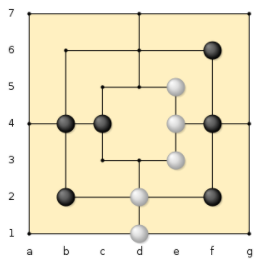

# Nine Men’s Morris

  
[Правила](https://archive.akopyan.ru/page.php?id=3603)

У каждого игрока есть по 9 фишек (фигурок). Игра начинается с первой части игры, с установки их на поле. Игроки по
очереди ставят по одной фишке на любую не занятую точку. Если процессе выставления фишек один из игроков строит «ряд»
(т.е. имеет три выстроенные в ряд фишки), то он может убрать одну фишку противника
(кроме тех, что находятся в «ряду»).

После выставления фишек начинается вторая часть игры. Также как и выставляли, игроки по очереди начинают двигать фишки.
Двигаться можно на любую свободную соседнюю точку. Игрок, который не может сделать ход – проигрывает.  

